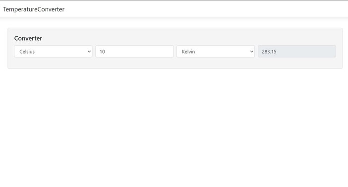

# TemperatureConverter

## Description

This project contains asp.net core angular appliaction that convert given temperature values to Celsius, Kelvin, or Fahrenheit.
I have use default .net core angular template rather than creating two separate angular and .net core projects because of ease of deployment.

## Demo

## Technologies Used

- Angular 8
- .Net core 3.1

## Technical Description

- How to run project:
  - Clone project.
  - Open project with viusal studio and run.

## Hosted URL

https://temperatureconverterapp.azurewebsites.net/temperature-converter
